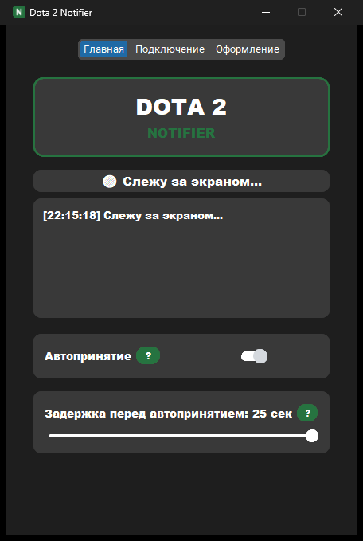

# Dota 2 Notifier

Текущая версия: **v1.0.0** ([история изменений](CHANGELOG.md))

Присылает уведомление в Telegram, когда в Dota 2 находится игра — и умеет сам нажать «Принять» за вас. Полезно, если вы стоите в очереди и не хотите всё время смотреть в экран.



## Зачем это нужно

Dota 2 не даёт удобного способа узнать о найденной игре, если вы отошли от компьютера: GSI-интеграция включается только после принятия, а лог пишется на диск только при выходе из игры. Поэтому приложение распознаёт окно поиска матча напрямую на экране (через сравнение с эталонным изображением кнопки «Принять») и реагирует на него.

## Как это работает

- **Клиент** (`client/`) — Windows-приложение с графическим интерфейсом. Раз в секунду проверяет экран на появление кнопки принятия матча.
- При обнаружении — либо сразу отправляет уведомление в Telegram, либо (если включено автопринятие) ждёт заданную задержку с обратным отсчётом и нажимает кнопку сама.
- **Сервер** (`server/`) — небольшой Flask-релей на Render.com, который пересылает уведomления в Telegram-бота. Токен бота хранится только на сервере и никогда не попадает в клиентское приложение.
- Привязка к боту — через `/start` в Telegram: бот присылает персональный ключ (`api_key`), который нужно один раз вставить в приложение. Ключ — это подписанный HMAC от вашего chat_id, поэтому сервер не хранит вообще никакой базы данных (что важно, так как бесплатный тариф Render стирает диск при каждом перезапуске).

## Возможности

- Уведомление в Telegram о найденной игре.
- Автопринятие с настраиваемой задержкой (0–25 секунд) и живым обратным отсчётом, который можно отменить.
- Вкладка «Оформление»: свои цвета фона/текста, фоновая картинка, выбор шрифта.
- Системный трей — приложение можно свернуть, не закрывая мониторинг.
- Иконки во всех нужных размерах (под разные масштабы экрана 100–200%).

## Установка (для пользователей)

1. Скачайте `DotaNotifier.exe` из [Releases](../../releases) — Python устанавливать не нужно.
2. Напишите `/start` нашему Telegram-боту, чтобы получить личный `api_key`.
3. Запустите `DotaNotifier.exe`, вставьте `api_key` на вкладке «Подключение».
4. Готово — оставьте приложение запущенным, оно само напишет в Telegram, когда найдётся игра.

> Автопринятие может работать не вполне корректно в полноэкранном (не оконном) режиме Dota 2 — рекомендуется оконный или безграничный оконный режим.

## Запуск из исходников

```bash
cd client
pip install -r requirements.txt
cp config.example.json config.json   # и вписать свой server_url/api_key
python dota_notifier.py
```

Сборка `.exe` (PyInstaller):

```bash
python -m PyInstaller --onefile --windowed --name DotaNotifier --icon app_icon.ico ^
  --add-data "accept_button_ru.png;." --add-data "accept_button_en.png;." ^
  --add-data "tray_icon.png;." --add-data "app_icon.ico;." dota_notifier.py
```

## Сервер

Деплоится на Render.com через `server/render.yaml`. Единственная переменная окружения — `TELEGRAM_BOT_TOKEN` (секрет бота, задаётся в панели Render, не в репозитории).

```bash
cd server
pip install -r requirements.txt
export TELEGRAM_BOT_TOKEN=...
python app.py
```

## Структура проекта

```
client/   GUI-приложение (CustomTkinter), скринскрейпинг, автопринятие, генерация иконок
server/   Flask-релей: /telegram-webhook (выдача api_key), /notify (отправка уведомлений)
docs/     Скриншоты для README
```

## Стек

Python, CustomTkinter, OpenCV/PyAutoGUI (поиск кнопки на экране), Pillow, PyInstaller, Flask + gunicorn (сервер), Telegram Bot API.

## Безопасность и честность

Приложение не читает память процесса Dota 2, не внедряется в игру и не модифицирует игровые файлы — оно только анализирует то, что видно на экране, и эмулирует обычный клик мыши, как это сделал бы человек.
